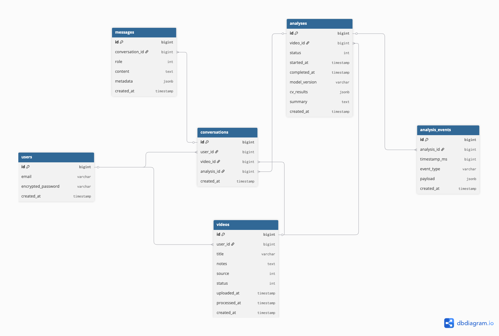
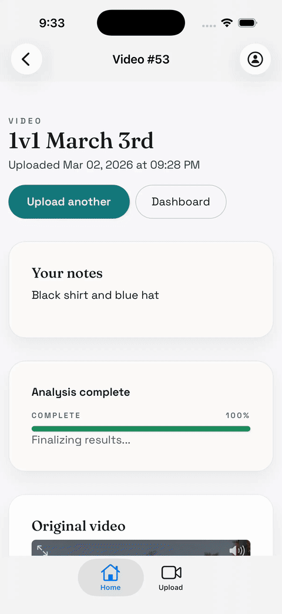

# Dinkster: Computer Vision + LLM Pickleball Coaching

An end-to-end pickleball coaching application that ingests player video, analyzes technique with computer vision, and delivers personalized LLM feedback to help players improve faster.


---

## Table of Contents
1. Project Motivation
2. Overview of Dinkster
3. Project Workflow
4. System Architecture
5. Key Features
6. Tech Stack & Tools
7. Methodology & Implementation
8. Evaluation & Results
9. Technical Challenges
10. Market Potential & Differentiators - potentially move this to #1, talk about TAM, competitors, etc. 
12. Future Work
13. Demo
14. Getting Started
15. Repository Structure
16. References
17. Acknowledgements & About Us

---

## Project Motivation
Pickleball is one of the fastest-growing sports in the U.S., but in-person coaching is limited, expensive, and inconsistent. Players frequently record themselves to self-diagnose issues, yet lack objective feedback or structured guidance.

Dinkster turns video into actionable coaching. By combining pose estimation, stroke segmentation, and LLM-based feedback, the system provides a personalized, scalable alternative to traditional coaching.


---

## Overview of Dinkster
Dinkster is a cloud-native coaching application that transforms unstructured video into structured performance insights.

The system:
- Accepts player video uploads from mobile or web
- Executes pose estimation and stroke analysis in the cloud
- Produces structured performance metrics
- Converts those metrics into personalized coaching feedback using an LLM
- Returns a simple, readable performance report to the user

At a high level, Dinkster bridges three domains:
1. Computer vision for extracting biomechanical signals
2. Structured analytics for quantifying technique
3. LLM interpretation for delivering human-readable coaching

The result is an end-to-end pipeline that feels intuitive to the user while running sophisticated analysis behind the scenes.

(include video or looped GIF of iphone screen here)

---

## Project Workflow
The workflow is intentionally designed to separate user experience from heavy computation.

1. User uploads a pickleball video
2. Video is stored in Google Cloud Storage
3. A Cloud Run job executes the YOLO Pose-26 based computer vision model and technique analysis
4. Structured output JSON is written back to cloud storage
5. The application parses the JSON and renders LLM-generated feedback


---

## System Architecture
The system is divided into two primary services with clearly defined responsibilities.

### Rails Application

- Handles UI rendering
- Manages authentication and orchestration
- Initiates Cloud Run jobs
- Polls for job completion
- Retrieves and renders analysis results

### Python Model Runner

- Ingests video from cloud storage
- Executes YOLO Pose-26 keypoint detection
- Computes technique-specific metrics
- Generates structured JSON output
- Calls the OpenAI API to produce coaching feedback




---

## Key Features
### Direct-to-Cloud Uploads
Large video files are uploaded directly to Google Cloud Storage via signed URLs, reducing server load and improving reliability.

### Automated Pose and Stroke Analysis
YOLO Pose-26 extracts body keypoints frame by frame. Custom scoring functions quantify readiness, stance, hip positioning, paddle height, and stability.

### LLM-Generated Coaching Feedback
Structured metrics are translated into concise, coach-like feedback using GPT-4o-mini, ensuring clarity and personalization.

### Polling-Based Results Page
The frontend checks for job completion and dynamically renders structured output when analysis is ready.

### Cloud Run Job Execution
Model processing runs as an on-demand Cloud Run job, enabling horizontal scaling and cost-efficient compute allocation.


---

## Tech Stack & Tools
- **Frontend/UI:** Rails views, iOS Swift for native Apple mobile capability
- **Backend:** Ruby on Rails, Cloud Run
- **Modeling:** Python, OpenAI API, YOLO Pose v26
- **Storage:** Google Cloud Storage
- **Deployment:** Cloud Build + Cloud Run


---

## Methodology & Implementation
### 1) Video Ingestion
Videos are uploaded directly to Google Cloud Storage using Active Storage direct uploads. This prevents application server bottlenecks and supports large file sizes typical of match recordings.

### 2) Pose and Technique Analysis
The Python model runner processes the video frame by frame. YOLO Pose-26 extracts 26 body keypoints. From these keypoints, the system computes derived metrics such as:

Knee preload depth
Stance width ratio
Hip sink relative to body height
Paddle readiness height
Temporal stability

These metrics are aggregated across frames to produce summary statistics including mean, percentile distributions, and decomposed penalty components.

### 3) LLM Feedback
Structured performance summaries are passed into a carefully constructed prompt. The LLM compares amateur metrics to professional baselines and generates concise coaching feedback that prioritizes the largest mechanical gaps.


---

## Evaluation & Results
Evaluation focuses on three dimensions:

- Runtime Performance: Average inference time per 10 second clip, Cloud Run job completion latency
- Coaching Quality: Alignment between penalty components and generated advice, human review of feedback clarity and specificity
- Example outputs include: Structured JSON analysis files, ReadyScore decompositions, sample LLM coaching responses


---

## Technical Challenges
### Large File Uploads in Cloud Run
Cloud Run is not optimized for streaming large uploads through the application server. We resolved this through direct-to-GCS uploads.

### Cross-Service Orchestration Without Workers
Instead of background job workers, we used Cloud Run Jobs triggered from Rails, with polling to track completion.

### Secure GCS Access Patterns
Signed URLs and scoped service accounts ensure least-privilege access between services.

### Low-Latency Feedback Generation
LLM calls are constrained to structured numeric inputs, minimizing token usage and ensuring predictable response time.

---

## Market Potential & Differentiators
Dinkster differentiates through:
Automated video-based coaching rather than manual review
Structured biomechanical scoring tied directly to advice
Integrated LLM interpretation rather than static rule-based tips
Mobile-first workflow designed for casual and competitive players

The product sits at the intersection of sports analytics, computer vision, and generative AI, positioning it for expansion into adjacent racket sports.

---

## Future Work
- Multi-angle video support
- Skill benchmarking and progress tracking
- Coach marketplace integrations
- Expanded dataset for higher-quality technique classification

---

## Demo

 


---

## Getting Started
### Repositories
- UI Backend: https://github.com/pbohea/pickleball-rails
- iOS Frontend: https://github.com/pbohea/pickleball-ios

### Model Runner (Python)
```bash
python main.py \
  --video gs://<bucket>/path/to/video.mp4 \
  --desc "Forehand drive" \
  --start 0 \
  --output gs://<bucket>/pickleball/outputs/output.json
```

### Cloud Run Job
The model runs as a Cloud Run Job and writes output JSON to GCS:
```
gs://<bucket>/pickleball/outputs/video_<id>analysis<analysis_id>.json
```

---

## Repository Structure
```
pickleball-capstone/
  README.md
  docs/
    images/
  notebooks/
```

---

## References
- Cloud Run GPU docs: https://docs.cloud.google.com/run/docs/configuring/services/gpu
- Cloud Run CD docs: https://docs.cloud.google.com/run/docs/continuous-deployment-with-cloud-build

---

## Acknowledgements & About Us
Capstone team project. Placeholder for team names, roles, and advisor acknowledgements.


